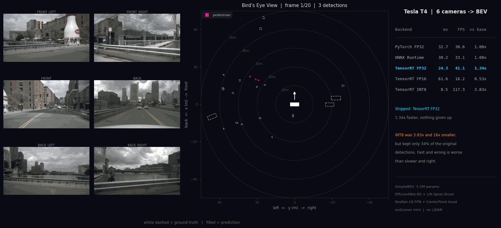
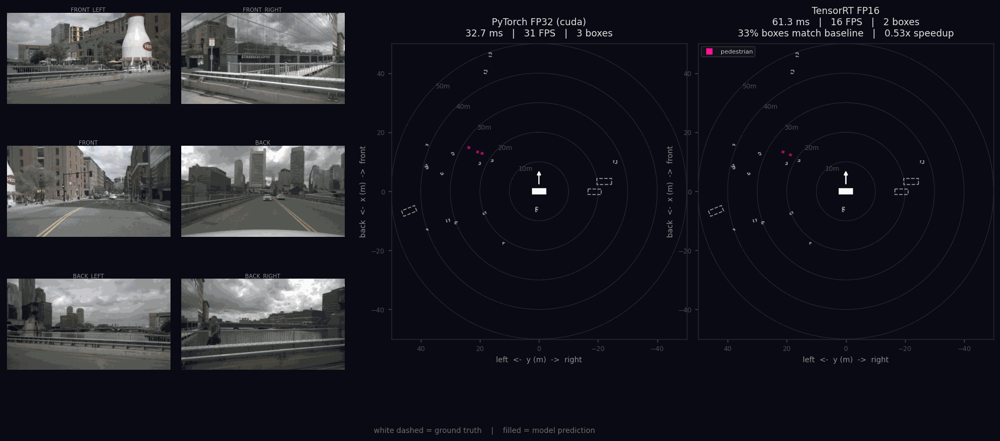
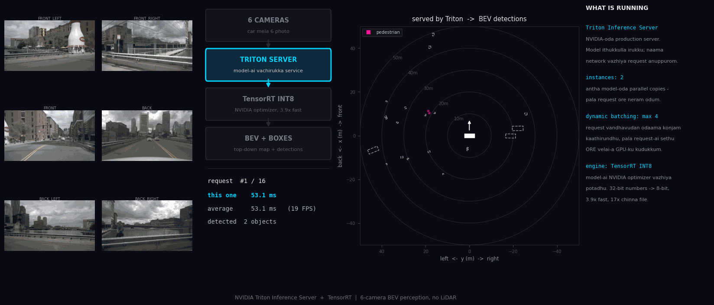

# Multi-Camera BEV Perception

**Six cameras on a car → a live top-down map of everything around it.
No lasers, no radar, no pre-built map of the street.**

[**▶ Try the live demo**](https://huggingface.co/spaces/dheepakkaran/multi-camera-bev)
 · built with PyTorch, TensorRT and NVIDIA Triton



---

## What this does

A self-driving car needs to know what is around it and *where*. The usual
answer is a spinning laser scanner on the roof — accurate, and $10,000 to
$75,000 per car.

This does it with cameras alone. Six of them fire at the same instant, and
the model turns those six flat photos into one map of the world seen from
above, with a box around every car, pedestrian and cyclist it finds. That
is the same bet Tesla made with FSD v12.

## Why that is hard

**A photo has no depth.** Look at a picture of a street: you know the car
is further away than the lamp post, but nothing in the pixels says
*twelve metres*. Two cars, one small and near, one large and far, can
occupy the exact same pixels.

The trick this model uses is to stop pretending it knows. For every point
in every image it predicts **64 different distances at once** — "maybe
5 m, probably 12 m, unlikely 40 m" — and carries all 64 possibilities
forward, weighted by confidence. Those weighted guesses get scattered into
a shared 3D map, and because all six cameras scatter onto the *same* map,
they fuse into one picture for free.

Once everything is on a flat top-down map, finding objects becomes an
ordinary 2D problem. That is the whole idea behind
[Lift-Splat-Shoot](https://arxiv.org/abs/2008.05711), and it is the heart
of this project.

---

## How it works

```
6 cameras (900x1600)  --resize + normalise-->  [6, 3, 224, 400]
                                                     |
                       EfficientNet-B0 (shared weights across cameras)
                                                     |
                                            [6, 64, 14, 25]
                                                     |
                     Lift-Splat-Shoot  <-- intrinsics K + extrinsics E
                     (64 depth bins, 2-50 m)
                                                     |
                                        [1, 64, 200, 200]   BEV, 0.5 m/cell
                                                     |
                               ResNet-18 + FPN BEV encoder
                                                     |
                                       [1, 128, 200, 200]
                                                     |
                               CenterPoint head (anchor-free)
                                                     |
     heatmap [10] | offset [2] | height [1] | size [3] | rot [2] | vel [2]
```

| Component | What it does | Parameters |
|---|---|---:|
| EfficientNet-B0 backbone | turns pixels into shapes and textures | 3,602,684 |
| Lift-Splat-Shoot | guesses depth, builds the top-down map | 4,160 |
| ResNet-18 + FPN encoder | adds context across the map | 1,428,608 |
| CenterPoint head | finds object centres, sizes, angles | 444,436 |
| **Total** | | **5,479,888** |

The map covers 100 m × 100 m around the car at 0.5 m per cell, with the
car at the centre.

---

## Results

### How fast (Tesla T4, one frame from all six cameras)

This is the part the project is really about — the same model, run five
different ways:

| Backend | Latency | FPS | Speedup | Detections kept |
|---|---:|---:|---:|---:|
| PyTorch FP32 | 32.66 ms | 30.6 | 1.00x | baseline |
| ONNX Runtime (CUDA) | 30.20 ms | 33.1 | 1.08x | 100% |
| **TensorRT FP32** | **24.34 ms** | **41.1** | **1.34x** | — |
| TensorRT FP16 | 61.56 ms | 16.2 | 0.53x | 66% |
| TensorRT INT8 | 8.52 ms | 117.3 | 3.83x | 34% |

*"Detections kept" = how many of the FP32 detections survive with the same
class within half a metre. It is the question that matters after
quantisation: is this still the same model?*

Engine size dropped from **49.4 MB to 3.1 MB** at INT8 — sixteen times
smaller.

**INT8 is the fastest and smallest, and it is not the one I would ship.**
At 34% agreement it is not producing the same detections any more; it
emits three to five times as many boxes, most of them noise. TensorRT FP32
gives a real 1.34x with nothing given up, and that is the honest choice
for this model.



### How accurate

| | NDS | mAP | car AP | pedestrian AP |
|---|---:|---:|---:|---:|
| Trained model (best epoch 5) | 0.043 | 0.011 | 0.094 | 0.016 |
| **Pipeline ceiling** (oracle) | **0.596** | **0.631** | 0.823 | 0.937 |

**Not good, and worth being clear about why.** nuScenes *mini* has
**323 training samples**. Published SimpleBEV numbers (NDS ≈ 0.30) come
from the full nuScenes set — **28,130 samples, 87x more data**. A
5.5 M-parameter model cannot learn 3D geometry from 323 frames, and it
does not: training loss falls to 0.65 while validation loss climbs from
4.45 to 9.36. Textbook overfitting on a tiny dataset.

The **oracle row** is the useful number. It pushes *ground-truth* boxes
through the exact same encode → decode → nuScenes-eval path the model
uses, to test the plumbing rather than the weights. It scores 0.596
instead of 1.0 because three classes have **zero instances** in the
validation split and nuScenes scores an absent class as AP 0 — over the
seven classes actually present, oracle mAP is **0.90**. The rest is the
0.5 m grid rounding object centres.

So the geometry, the target encoding, the decoder and the evaluation are
all verified correct. What is missing is data.

---

## Serving it with NVIDIA Triton



Training a model is one thing; putting it behind an endpoint that other
software can call is another. This runs on **NVIDIA Triton** via PyTriton,
which hosts the real Triton server in-process — no Docker, which matters
on free GPU notebooks.

| | |
|---|---|
| Engine | TensorRT INT8 |
| Model instances | 2, each with its own TensorRT execution context |
| Dynamic batching | max batch 4, 2 ms queue delay |
| Median latency, client-side | 48.56 ms (20.6 FPS) |

**That 48.56 ms is 40 ms slower than calling the same engine directly
(8.52 ms), and none of the difference is compute.** Every request ships a
`[6, 3, 224, 400]` float32 input (6.4 MB) and six output maps (3.2 MB)
over HTTP with NumPy serialisation at both ends — about 10 MB per
inference. The model finishes in 8.5 ms and then waits on the wire.

The fix is gRPC plus CUDA shared memory, so client and server point at the
same GPU buffers and the tensors never leave the device. That is not
implemented here. The number above is what an unoptimised HTTP client
actually costs, which seemed more useful to measure than to hide.

A conventional Docker `model_repository` with an ensemble and
`instance_group` config is also in `triton_deploy/` for a real GPU host.

---

## Running it

```bash
python3 -m venv bev_env && source bev_env/bin/activate
pip install -r requirements.txt
```

Download nuScenes **mini** (v1.0-mini, ~4 GB) from
[nuscenes.org/download](https://www.nuscenes.org/download) into
`data/nuscenes-mini/`.

```bash
python -m training.train --epochs 10           # ~70 s/epoch on Apple MPS
python -m training.evaluate --ckpt runs/simplebev/best.pth
python -m visualization.make_demo --frames 20  # the demo GIF above
python -m export.export_onnx                   # ONNX + numerical check
```

On an NVIDIA GPU (T4 / Colab / Kaggle):

```bash
python -m export.calibrate_int8 --precision fp32
python -m export.calibrate_int8 --precision int8
python -m export.benchmark
python -m triton_deploy.triton_demo --frames 16 --precision int8 --instances 2
```

```
data/scripts/     constants, camera loader, 6-camera sample loader, Dataset
models/           backbone, view_transformer (LSS), bev_encoder, center_head
training/         losses (focal + L1), train loop, nuScenes NDS evaluation
export/           ONNX export, FP16/INT8 engines, unified backends, benchmark
triton_deploy/    PyTriton server + Docker model repository + client
visualization/    BEV renderer, precision comparison, demo generators
hf_space/         the live Gradio demo
```

---

## Engineering notes

The parts that cost real debugging time. Most of it is TensorRT 11
behaviour that is not in the older tutorials.

**Intrinsics must be rescaled with the image.** Resizing 1600x900 to
400x224 without scaling `K` by the same factors puts every projected point
in the wrong cell of the map. `fx, cx` scale by 0.25; `fy, cy` by 0.2489.

**ONNX cannot export `index_add_` with duplicate indices** — and
duplicates are exactly what the map pooling needs, since many pixels vote
into one cell. `scatter_add` maps to `ScatterElements(reduction='add')`
and exports cleanly.

**TensorRT needs its plugin registry initialised** before parsing that
graph. Without `trt.init_libnvinfer_plugins(logger, "")` the parser fails
with *"ScatterReduction plugin was not found"* and the decoder cannot be
built at all.

**TensorRT 11 removed the precision builder flags.** There is no
`BuilderFlag.FP16` or `BuilderFlag.INT8` any more — the network is
strongly typed, so precision has to be expressed in the ONNX itself. FP16
became an `onnxconverter_common` conversion; INT8 became explicit QDQ
nodes.

**TensorRT only accepts symmetric quantisation.** ONNX Runtime's default
static quantisation emits non-zero zero-points and int32 biases, and
TensorRT rejects both. `ActivationSymmetric`, `WeightSymmetric` and
`QuantizeBias=False` fix it.

**FP16 came out 2.3x slower than FP32, and the obvious explanation was
wrong.** `onnxconverter_common` keeps `Resize` in fp32 by default, which
strands the FPN upsamples in fp32 islands surrounded by casts — 17 Cast
nodes over 9.7 M elements. Clearing `op_block_list` cut that to 11 casts
over 1.7 M elements and moved the latency by 0.4 ms. So the casts were not
it. The remaining suspect is the scatter plugin having no fp16 kernel,
forcing conversions around the 8.6 M-element lifted volume. Measured, not
resolved.

**Geometry is computed once, on the host.** Camera calibration is fixed on
a given vehicle, so the frustum-to-ego point cloud never changes between
frames. Hoisting it out of the graph removes `torch.inverse` (poorly
supported in ONNX/TensorRT) and avoids recomputing 134,400 points every
frame.

**Never name a directory `triton/` in a project that imports PyTorch.** It
shadows the real `triton` package and breaks `torch._dynamo` with
`module 'triton' has no attribute 'language'`.

**Verify the harness before blaming the model.** Pushing ground truth
through the decode path — the oracle run above — is what proved 0.043 NDS
was a data problem and not a geometry bug, and it also surfaced the three
classes missing from the validation split entirely.

---

## Stack

PyTorch · timm (EfficientNet-B0) · nuScenes devkit · ONNX / ONNX Runtime ·
TensorRT · NVIDIA Triton (PyTriton) · Gradio · Docker · OpenCV ·
Matplotlib

Benchmarks measured on a Tesla T4 (Kaggle). Training and visualisation on
Apple Silicon (MPS). Live demo on Hugging Face ZeroGPU.
